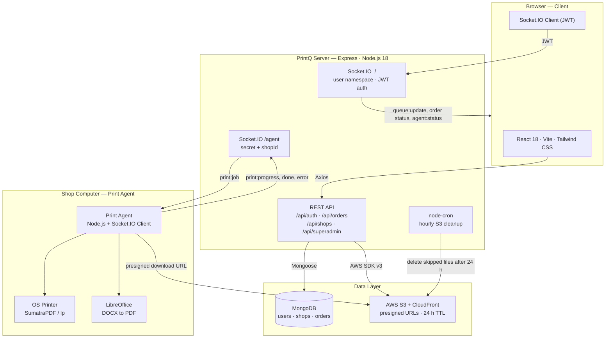
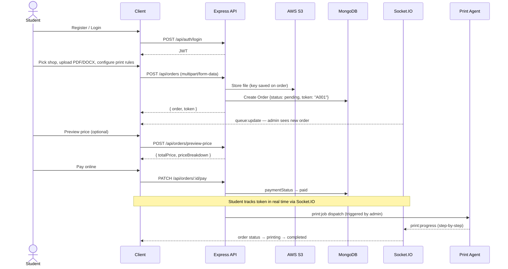
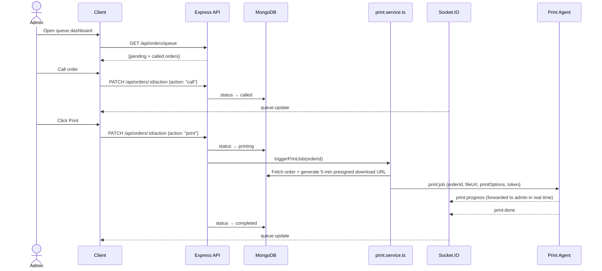
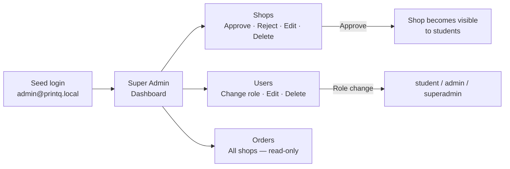
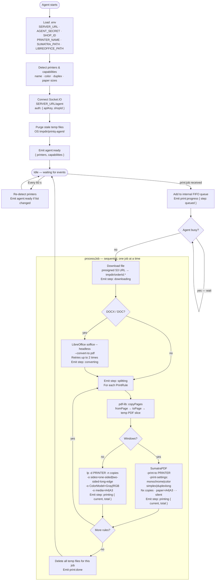

# PrintQ — Intelligent Print Queue Management

A full-stack MERN application for managing college print-shop queues in real time. Students upload documents, receive a live token, and track their order status. Shop admins manage the live queue, history, and pricing. Super admins oversee all shops, users, and orders. A local **Print Agent** runs on each shop's machine to automatically execute print jobs sent from the server.

---

## Tech Stack

| Layer | Technologies |
|-------|-------------|
| Frontend | React 18, Vite 5, TypeScript, Tailwind CSS v3, Socket.IO Client, Axios, react-hot-toast, pdfjs-dist, JSZip |
| Backend | Node.js 18+, Express, TypeScript, Mongoose 8, Socket.IO, node-cron |
| Database | MongoDB (local or Atlas) |
| Auth | JWT + bcryptjs |
| File Storage | AWS S3 + CloudFront (presigned URLs, auto-delete after 24 h) |
| File Upload | Multer (memory storage, 25 MB limit, PDF + DOCX) |
| Print Agent | Node.js, Socket.IO Client, pdf-lib, SumatraPDF (Windows) / lp (Linux/macOS), LibreOffice (DOCX conversion) |

---

## Features

- **Student** — Register, browse approved shops, upload a PDF or DOCX, configure per-page print rules (color mode, sided, page range, copies, paper size), choose binding, pay online or at counter, preview price before submitting, edit/cancel pending orders, and track live token status via Socket.IO
- **Admin (Shop Owner)** — Register a print shop with custom per-page pricing, manage the live queue (call / print / skip / complete / set priority), download uploaded files via CloudFront presigned URLs, view filterable order history & analytics dashboard
- **Super Admin** — Approve / reject / edit / delete shop registrations, edit or delete users, change user roles, view all orders across every shop
- **Print Agent** — Runs locally on the shop's computer; connects to the server via Socket.IO, receives print jobs, handles per-rule PDF page extraction, DOCX→PDF conversion, color/duplex/copies settings, and reports progress back in real time
- **Tokens** — Format `[A–J][001–999]`, reset daily at midnight via node-cron
- **PDF Preview** — In-browser page-by-page preview before submission
- **Smart print rules** — First rule auto-fills the full page range; each new rule continues from where the last one ended
- **Printer capability detection** — Agent auto-detects connected printers and their color/duplex support and reports them to the server

> Super Admin is created via the seed script — it cannot be self-registered.

---

## System Architecture



The server exposes **two Socket.IO namespaces**:

| Namespace | Auth | Direction | Purpose |
|-----------|------|-----------|--------|
| `/` (default) | JWT token | Server → Browser | Live `queue:update`, order status changes, `agent:status` (online / offline) pushed to each user's private room |
| `/agent` | `AGENT_SECRET` + `SHOP_ID` | Bidirectional | Server dispatches `print:job`; agent reports `print:progress` / `print:done` / `print:error` which are forwarded to the shop owner's browser session |

---

## Workflow Diagrams

### Student Order Flow



### Admin Queue Flow



### Super Admin Flow



---

## Project Structure

```
PrintQ/
├── server/                  # Express API (MVC + TypeScript)
│   └── src/
│       ├── config/          # env.ts, db.ts, s3.ts
│       ├── controllers/     # auth, order, shop, superadmin
│       ├── jobs/            # cleanup.ts (cron job)
│       ├── middleware/      # auth guard, multer upload, error handler
│       ├── models/          # User, Order, Shop (Mongoose)
│       ├── routes/          # auth, order, shop, superadmin
│       ├── scripts/         # seedAdmin.ts
│       ├── services/        # print.service.ts
│       ├── sockets/         # Socket.IO setup, agent namespace & event emitters
│       ├── types/           # shared TypeScript interfaces
│       ├── utils/           # JWT helpers, pricing calc, token counter, S3 utils
│       ├── app.ts
│       └── server.ts
├── client/                  # React SPA (Vite + TypeScript)
│   └── src/
│       ├── api/             # Axios clients (auth, orders, shops, superadmin)
│       ├── components/      # Navbar, ProtectedRoute, OrderDetailModal
│       ├── context/         # AuthContext, SocketContext
│       ├── pages/           # HomePage, LoginPage, RegisterPage
│       │                    # StudentDashboard, StudentOrders, StudentLayout
│       │                    # AdminDashboard, AdminQueue, AdminHistory
│       │                    # AdminShopRegistration, AdminAnalytics, AdminLayout
│       │                    # SuperAdminDashboard
│       ├── styles/          # Tailwind CSS entry
│       └── types.ts         # Shared frontend types
└── print-agent/             # Local print agent (Node.js + TypeScript)
    └── src/
        ├── jobs/            # processJob.ts — orchestrates download → convert → split → print
        ├── lib/             # converter.ts, downloader.ts, pdfSplit.ts, printer.ts
        ├── types.ts
        └── agent.ts         # Entry point — Socket.IO client, job queue, printer refresh
```

---

## Getting Started

### Prerequisites

- Node.js ≥ 18
- MongoDB (local instance or Atlas URI)
- AWS account with an S3 bucket + CloudFront distribution *(optional for local dev — uploads work without CDN)*

### 1. Backend

```bash
cd server
npm install
cp .env.example .env   # fill in values (see Environment Variables below)
npm run dev             # http://localhost:5000
```

### 2. Frontend

```bash
cd client
npm install
cp .env.example .env   # set VITE_API_BASE_URL and VITE_SOCKET_URL
npm run dev             # http://localhost:5173
```

### 3. Seed the Super Admin

```bash
cd server
npm run seed:admin
```

### 4. Print Agent *(on each shop's computer)*

```bash
cd print-agent
npm install
cp .env.example .env   # fill in SERVER_URL, AGENT_SECRET, SHOP_ID, printer paths
npm run dev             # or: npm run build && npm start
```

---

## Environment Variables

### `server/.env`

```env
# App
PORT=5000
NODE_ENV=development
CLIENT_URL=http://localhost:5173

# Database
MONGODB_URI=mongodb://127.0.0.1:27017/printq

# Auth
JWT_SECRET=your_jwt_secret_here
JWT_EXPIRES_IN=1d

# Super Admin seed
SEED_ADMIN_NAME=PrintQ Admin
SEED_ADMIN_EMAIL=admin@printq.local
SEED_ADMIN_PASSWORD=Admin@123

# AWS S3 + CloudFront
AWS_ACCESS_KEY_ID=your_access_key
AWS_SECRET_ACCESS_KEY=your_secret_key
AWS_REGION=us-east-1
AWS_S3_BUCKET=your-bucket-name
AWS_CLOUDFRONT_DOMAIN=https://xxxxx.cloudfront.net

# Print Agent shared secret (must match AGENT_SECRET in print-agent/.env)
AGENT_SECRET=change_me_agent_secret
```

### `client/.env`

```env
VITE_API_BASE_URL=http://localhost:5000/api
VITE_SOCKET_URL=http://localhost:5000
```

### `print-agent/.env`

```env
# Server connection
SERVER_URL=http://localhost:5000
AGENT_SECRET=change_me_agent_secret

# Shop identity
SHOP_ID=your_shop_mongo_id_here

# Printer (leave empty to use OS default)
PRINTER_NAME=

# Windows — path to SumatraPDF.exe (leave empty if in PATH)
SUMATRA_PATH=

# DOCX conversion — path to LibreOffice soffice (leave empty if in PATH)
LIBREOFFICE_PATH=
```

---

## Available Scripts

| Location | Command | Description |
|----------|---------|-------------|
| `server/` | `npm run dev` | Start API with nodemon + ts-node |
| `server/` | `npm run build` | Compile TypeScript to `dist/` |
| `server/` | `npm start` | Run compiled build |
| `server/` | `npm run seed:admin` | Create the super admin account |
| `client/` | `npm run dev` | Start Vite dev server |
| `client/` | `npm run build` | Production build to `dist/` |
| `client/` | `npm run preview` | Preview production build |
| `print-agent/` | `npm run dev` | Run agent with ts-node |
| `print-agent/` | `npm run build` | Compile TypeScript to `dist/` |
| `print-agent/` | `npm start` | Run compiled agent |

---

## API Routes

### Auth — `/api/auth`
| Method | Endpoint | Access |
|--------|----------|--------|
| POST | `/register` | Public |
| POST | `/login` | Public |
| GET | `/me` | Authenticated |

### Orders — `/api/orders`
| Method | Endpoint | Access |
|--------|----------|--------|
| POST | `/` | Student |
| POST | `/preview-price` | Student |
| GET | `/my` | Student |
| GET | `/queue` | Admin |
| GET | `/history` | Admin |
| PATCH | `/:id/pay` | Student |
| GET | `/:id/queue-status` | Student |
| PATCH | `/:id/edit` | Student |
| DELETE | `/:id` | Student |
| PATCH | `/:id/action` | Admin |
| PATCH | `/:id/priority` | Admin |
| GET | `/:id/download` | Admin |

### Shops — `/api/shops`
| Method | Endpoint | Access |
|--------|----------|--------|
| POST | `/register` | Admin |
| GET | `/mine` | Admin |
| PATCH | `/pricing` | Admin |
| GET | `/approved` | Student |

### Super Admin — `/api/superadmin`
| Method | Endpoint | Access |
|--------|----------|--------|
| GET | `/shops` | Super Admin |
| PATCH | `/shops/:id/status` | Super Admin |
| PATCH | `/shops/:id` | Super Admin |
| DELETE | `/shops/:id` | Super Admin |
| GET | `/users` | Super Admin |
| PATCH | `/users/:id/role` | Super Admin |
| PATCH | `/users/:id` | Super Admin |
| DELETE | `/users/:id` | Super Admin |
| GET | `/orders` | Super Admin |

---

## Database Schema

### Users

| Field | Type | Notes |
|-------|------|-------|
| `_id` | ObjectId | Auto-generated |
| `name` | String | Required |
| `email` | String | Unique, lowercase |
| `password` | String | bcrypt hash |
| `role` | `"student"` \| `"admin"` \| `"superadmin"` | Default: `"student"` |
| `mobile` | String? | Optional |
| `createdAt` / `updatedAt` | Date | Auto (timestamps) |

### Shops

| Field | Type | Notes |
|-------|------|-------|
| `_id` | ObjectId | Auto-generated |
| `owner` | ObjectId → User | Unique — one shop per admin |
| `name` | String | Required |
| `address` | String | Required |
| `phone` | String | Required |
| `services` | String[] | e.g. `["Binding", "Lamination"]` |
| `status` | `"pending"` \| `"approved"` \| `"rejected"` | Default: `"pending"`, indexed |
| `pricing.bwSingle` | Number | Per-page rate, default ₹2.00 |
| `pricing.bwDouble` | Number | Per-page rate, default ₹1.50 |
| `pricing.colorSingle` | Number | Per-page rate, default ₹5.00 |
| `pricing.colorDouble` | Number | Per-page rate, default ₹4.00 |
| `createdAt` / `updatedAt` | Date | Auto (timestamps) |

### Orders

| Field | Type | Notes |
|-------|------|-------|
| `_id` | ObjectId | Auto-generated |
| `student` | ObjectId → User | Required |
| `shop` | ObjectId → Shop | Required |
| `token` | String | Unique, indexed — format: `[A-J][001-999]` |
| `originalFileName` | String | Display name shown in UI / download |
| `fileKey` | String | S3 object key |
| `fileUrl` | String | CloudFront CDN URL |
| `fileDeleted` | Boolean | `true` after hourly cron removes the S3 object |
| `printOptions.printRules` | PrintRule[] | Array of per-range print rules (see below) |
| `printOptions.copies` | Number | Global copy count (min 1) |
| `printOptions.paperSize` | `"A4"` \| `"A3"` | |
| `printOptions.binding` | `"none"` \| `"spiral"` \| `"staple"` | Default: `"none"` |
| `totalPrice` | Number | Computed by `calculatePrice()` at submission |
| `priceBreakdown` | `{ label, amount }[]` | Line-item cost breakdown |
| `paymentStatus` | `"unpaid"` \| `"paid"` | Default: `"unpaid"` |
| `status` | `"pending"` \| `"called"` \| `"printing"` \| `"skipped"` \| `"completed"` | Indexed |
| `priority` | Boolean | Admin-set priority flag, default `false` |
| `createdAt` / `updatedAt` | Date | Auto (timestamps) |

**PrintRule sub-document** (embedded, no `_id`):

| Field | Type | Values |
|-------|------|--------|
| `fromPage` | Number | 1-based start page |
| `toPage` | Number | 1-based end page |
| `colorMode` | String | `"bw"` \| `"color"` |
| `sided` | String | `"single"` \| `"double"` |

**Token format:** letter cycles A–J per day; number is a random 001–999 slot. `nextToken()` queries today's orders to avoid collisions. When all 999 slots for a letter are exhausted, it advances to the next letter automatically.

**Pricing formula** (from `utils/pricing.ts`):
```
total = Σ ( pages_per_rule × rate_per_page ) × copies
```
where `rate_per_page` is looked up from the shop's pricing object based on `colorMode` × `sided`.

**S3 cleanup:** A `node-cron` job runs hourly and deletes S3 files for orders that have been in `skipped` status for more than 24 hours, then sets `fileDeleted = true` on the order.

---

## Print Agent Architecture



**Socket.IO events emitted by the agent (forwarded server → shop owner's browser):**

| Event | When | Key payload fields |
|-------|------|--------------------|
| `agent:ready` | On connect + every 60 s if printer list changed | `printers: string[]`, `capabilities: PrinterCapabilities[]` |
| `print:progress` | At each processing step | `orderId`, `step`, `current?` (rule index), `total?` (rule count), `message?` |
| `print:done` | All rules printed successfully | `orderId`, `token` |
| `print:error` | Unrecoverable failure | `orderId`, `message` |
| `print:warning` | Non-fatal issue (e.g. partial success) | `orderId`, `message` |

**`step` values for `print:progress` (in order):**

| `step` | Meaning |
|--------|---------|
| `queued` | Job added to the agent's internal FIFO queue |
| `downloading` | Fetching file from the S3 presigned URL |
| `converting` | LibreOffice converting DOCX → PDF (DOCX files only) |
| `splitting` | pdf-lib extracting the page range for the current rule |
| `printing` | Sending slice to the OS printer (`current` / `total` set to rule index) |
| `done` | All rules printed successfully |
| `error` | Fatal error — temp files cleaned up |

The server's `/agent` namespace middleware **forwards all agent events in real time** to the shop owner's private Socket.IO room (`user:{ownerId}`), so admins see live printing progress in the queue UI without any polling.

---

## Build for Production

```bash
# Server
cd server && npm run build && npm start

# Client
cd client && npm run build   # serve dist/ with your web server

# Print Agent
cd print-agent && npm run build && npm start
```

---

## License

MIT

---

## Author

Developed by **Abhishek Nalatawad** — [abhia7535@gmail.com](mailto:abhia7535@gmail.com)